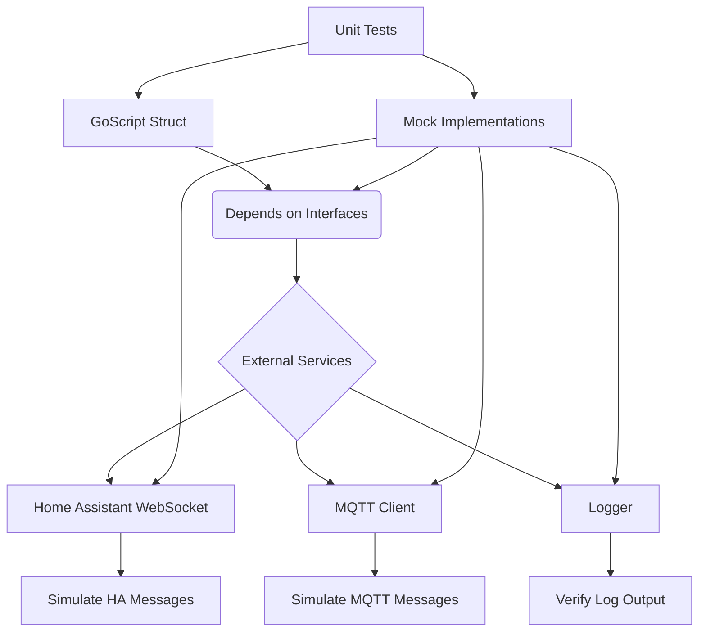

# Comprehensive Testing Setup Plan with Mocking

**Objective:** Implement a comprehensive unit testing setup for the `pkg/core` package using mocking, specifically focusing on interactions with external services and critical logic.

**Approach:**

1.  **Introduce `gomock`:** Integrate the `gomock` mocking framework into the project. This will involve adding the necessary dependencies and potentially setting up mock generation.
2.  **Identify Mocking Targets:** Analyze the `pkg/core` code to identify interfaces and types that represent external dependencies (e.g., Home Assistant WebSocket connection, MQTT client, logger, configuration parsing dependencies). These will be the targets for mocking.
3.  **Generate Mocks:** Use `gomock`'s mock generator to create mock implementations for the identified interfaces/types.
4.  **Refactor for Testability (if needed):** If the current code in `pkg/core` is tightly coupled to concrete implementations of external services, refactor it to depend on interfaces instead. This will allow injecting mock implementations during testing.
5.  **Write Unit Tests:**
    *   Create new test files (e.g., `filename_test.go`) for the relevant files in `pkg/core`.
    *   For each test case, set up the test environment by creating instances of the `GoScript` struct and injecting mock dependencies.
    *   Define expected calls and return values on the mock objects using `gomock`'s API.
    *   Execute the code under test.
    *   Assert that the code behaves as expected and that the correct calls were made on the mock objects.
6.  **Focus Areas for Initial Tests:**
    *   Testing the `Connect()` method: Mock the WebSocket connection to simulate successful and failed connections, and verify that the `GoScript` state is updated correctly.
    *   Testing message handling (`messageHandler`, `handleMessage`): Mock the WebSocket connection to simulate receiving different types of messages from Home Assistant and verify that the appropriate internal logic is triggered (e.g., state updates, command responses).
    *   Testing service calls: Mock the WebSocket connection's ability to send messages and verify that when a service call is placed on the `ServiceChan`, the correct message is sent over the mocked connection.
    *   Testing configuration parsing (`ParseConfig`, `ParseConfigData`): While less reliant on external services, unit tests can verify that the configuration is parsed correctly into the `Config` struct and that modules are loaded as expected. Mocking can be used for dependencies like the YAML unmarshaller if needed, though Go's standard library/popular libraries often provide testable functions.
    *   Testing trigger evaluation and execution: Mock the state retrieval and potentially the `Task` object's methods (`Sleep`, `WaitUntil`, `While`) to test the logic within trigger functions without actual delays or external interactions.
7.  **Iterate and Expand:** Start with critical paths and gradually add tests for more functionality within `pkg/core`.

**Mermaid Diagram:**

**Next Steps:**

Upon approval of this plan, I will proceed with implementing the testing setup in Code mode. This will involve writing test files, generating mocks, and potentially refactoring code for better testability.